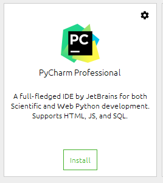
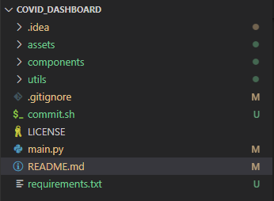

# COVID-19 Dashboard
Hello there! Welcome to the corona dashboard made by team 1!

---
## Setup and installations
So before we start into acutal coding, we have to make sure that we configure the correct environment and install the required packages. 
For starters, I highly reccomend using PyCharm. It can be a bit tricky at first, but once you setup everything your good to go! 

Open up your **Anaconda Navigator** and on the main screen you should see a program called 'PyCharm Professional' and **install** it, which looks something like this:

 

Once you have it installed, run it so we can configure the environment and interpreter. If it asks you to import settings, you can just skip that part. You should be getting the screen that tells you to create or open an existing project. Open the **covid_dashboard** folder. Now you should be seeing a grey-ish screen. This is basically the PyCharm environment. To the left you can see a few tabs whereas we should be focussing on the **Project** tab, press it. Now we can see the folder structure of our covid_dashboard. 

Before we can actually start to run and edit the code, we need to configure the interpreter and environment we are currently working in. At the bottom right, there should be a tab name **< No Interpreter >**, press it and press the **Add interpreter...** option. This open ups a new window and at the left you can see the **Conda environment** select that one. Now you, select the **Existing environment** option and try to locate the *python.exe* file in your anaconda3 folder, mine looked something like this: `E:\MINOR\anaconda3\python.exe` . After you configured the interpreter, now you should configure the **Conda executable** which is also in the anaconda3 folder. Mine looked like this: `E:\MINOR\anaconda3\Scripts\conda.exe`. If you are still struggling, refer to these links
- https://docs.anaconda.com/anaconda/user-guide/tasks/pycharm/
- https://www.jetbrains.com/help/pycharm/configuring-python-interpreter.html#add-existing-interpreter

Awesome! No we are ready to go (actually not, but we can start to code). It's time to open up the magic wand aka the **Terminal**. You can locate the terminal at the tabs left-below of your screen. Open a terminal and execute the following command:
```sh 
pip install -r requirements.txt
```
It may be saying things like 'Requirements already satisfied', but thats a good thing. Once you can enter another command in the terminal, that means the installation of the packages is complete.

---
## Project structure
Let's take a look at the project structure shall we (don't mind the funky colors):



The main files and fodler we should be focussing on are the [components](components), [utils](utils), [data](data) and [main.py](main.py). The main file is that starting point of all the code. It should be consisting of lots of functions that will be called of different scripts. These scripts will be coming from the components folder. This folder consists of all the components we will be using/creating. Say for example a plot of registered cases for every country or the amount of deaths over the past months. The data folder is just the data folder where we put all our csv files. The utils folder consists of a few 'helper' functions and variables we may need. 

---
## Executing the code
To run the streamlit application locally, simply execute the following command:
```sh
streamlit run main.py
```
After compiling the code, it should tell you that you can view the app in your browser at the URL *http://localhost:8501* or something like that. If not, there may have gone something wrong with the installation of packages. Perhaps rerun the command above.

---
## Commit changes
Committing changes can be a bit of a pain in the a**. But to ease it out, I made a [commit](commit.sh) script that does all the work for you. Before we get into let, let's discuss the theory. 

While working on a project, we would like to seperate the development and main or master versions of the project. In this project, there are 2 branches: development and master. All our progress should be pushed on the development branch and all that is finished and done should be pushed on the master branch. The development branch is exactly the same as master, but a bit more messy.

**IMPORTANT!** When working on the project, please stay in the **development** branch. You can do this by simply executing the following command:
```sh
git checkout development
```

Now you are allowed to break everything (but don't). Now in order to push your changes live, we need to open up the terminal again (left-below **Terminal** tab) and this time press the **down arrow** and select command prompt. Now you can execute the following command:
```sh
commit.sh
```
In case an error pops up, please contact me or check out the following link (if you dare):
- https://www.jetbrains.com/help/pycharm/resolving-conflicts.html#distributed-version-control-systems
 
*Now you are ready to go! Happy coding :smile:!*
